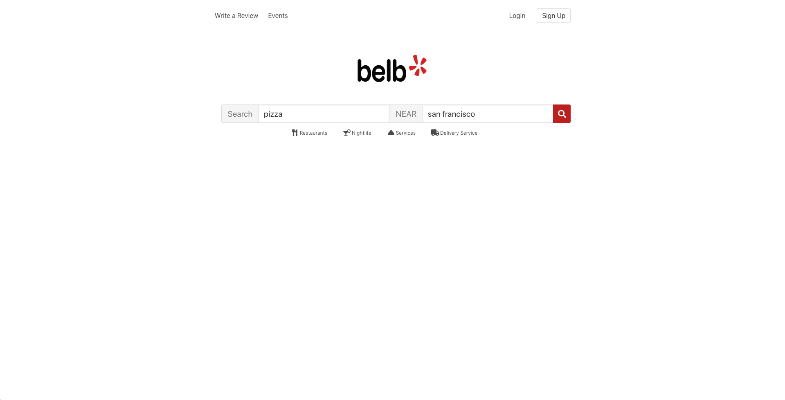
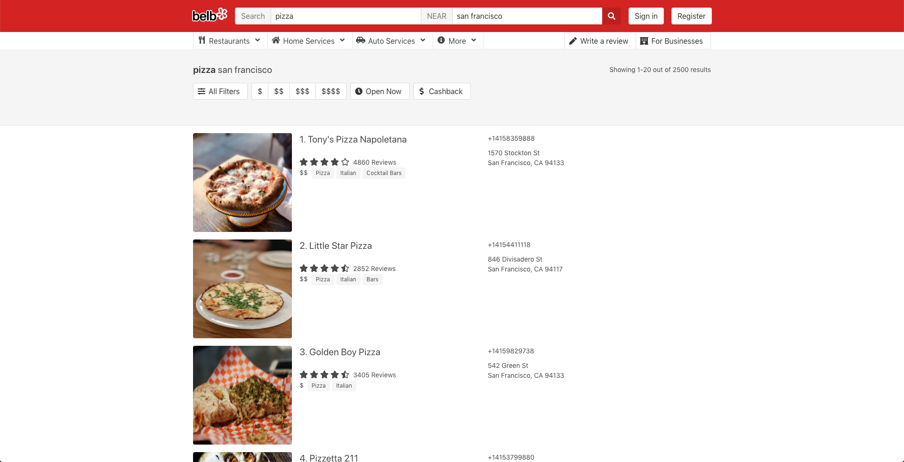

# 1 About
This repository contains the source code for the **Build Yelp in React | React Hooks Tutorial** provided by [productioncoder.com](https://www.youtube.com/watch?v=8asNYp7koRg).

Sign up for [this email list](https://productioncoder.com/you-decide-what-we-build-next/) so you get a vote in what we will publish next.

For updates please follow [@productioncoder](https://twitter.com/productioncoder) on Twitter.

# 2. Demo
**[Please check out the videos on Youtube](https://www.youtube.com/watch?v=8asNYp7koRg)**


# 3. Screenshots
The application uses real data by leveraging the [Yelp Fusion API](https://www.yelp.com/developers/documentation/v3).

## 3.1. Home


## 3.2. Search for businesses / restaurants


# 4. Caveats
* This app uses the [CORS Anywhere](https://github.com/Rob--W/cors-anywhere/#documentation) because the [Yelp Fusion REST API](https://www.yelp.com/developers/documentation/v3) is meant for server to server communication and does not support [CORS](https://developer.mozilla.org/en-US/docs/Web/HTTP/CORS)
* For the sake of the tutorial, we decided to proxy all request through [CORS Anywhere](https://github.com/Rob--W/cors-anywhere/#documentation) so we can focus on building the frontend part of the application.
* **You should not run this in production because you would expose a `Bearer token` on the client side**. We only did this so that this tutorial can focus on the frontend. Later on we might develop a server for this application as well if people express enough interest.
* **DO NOT commit your bearer token to source control if you work on a public repository.**

# 5. How to run this Application
This application looks pretty much the same like the original [Yelp](https://www.yelp.com) website.

It leverages the free [Yelp Fusion REST API](https://www.yelp.com/developers/documentation/v3) for which you need an API key.

1. Head over to the [Yelp Fusion API documentation](https://www.yelp.com/developers/documentation/v3)
2. Click on `Create App` and sign in if you haven't done so already
3. Once you have signed in, click on the `Get Started` button. If you already have an app, then you will already see the API key
4. Fill out the form for [creating a new app](https://www.yelp.com/developers/v3/manage_app)
5. Copy the generated `API key`. This is a [bearer token](https://stackoverflow.com/questions/25838183/what-is-the-oauth-2-0-bearer-token-exactly/25843058) that must be put inside the header of each request
6. Navigate to the `src/hooks/yelp-api/config.js` file and assign the `BEARER_TOKEN` variable the following content
   ```
   const BEARER_TOKEN = '<your-token-here>'
   ```
7. Install the dependencies by running `npm install` or `yarn install`
8. Run the app with `npm start` or `yarn start`


# 6. Used Technologies
* [React / create-react-app](https://github.com/facebook/create-react-app)
    * **only functional components**
    * communication with web servers with [React Hooks](https://reactjs.org/docs/hooks-intro.html) only
    * no higher order or class-based components
* [React router](https://github.com/ReactTraining/react-router) with [useReactRouter](https://github.com/CharlesStover/use-react-router)
* [Bulma](https://bulma.io)
* Flexbox

# 7. Disclaimer
This project is **solely intended for educational purposes** and is created under **fair use**.

It is **not intended to create any kind of Yelp competitor**, but to teach advanced concepts in frontend development.

Just see it a nice educational project that will help you to improve your coding skills.

